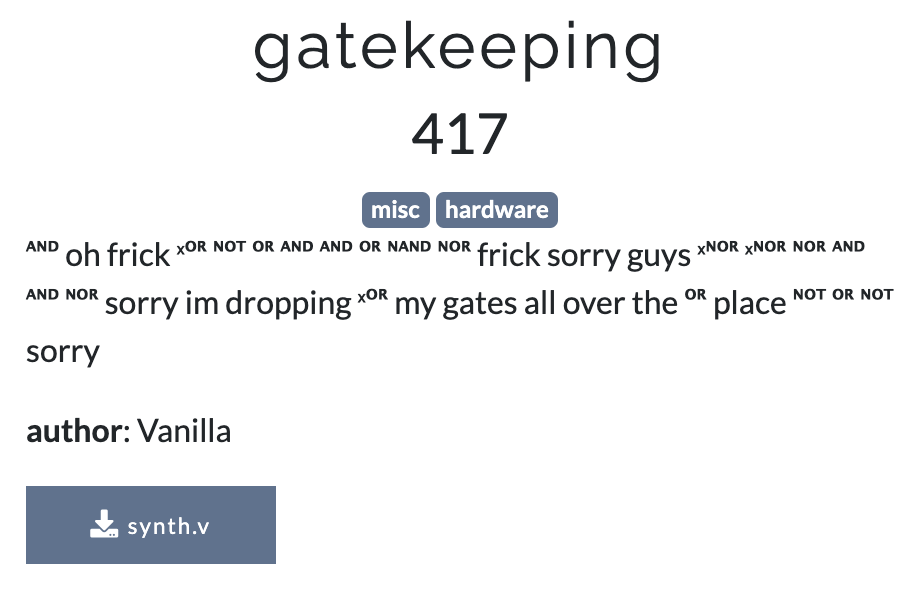
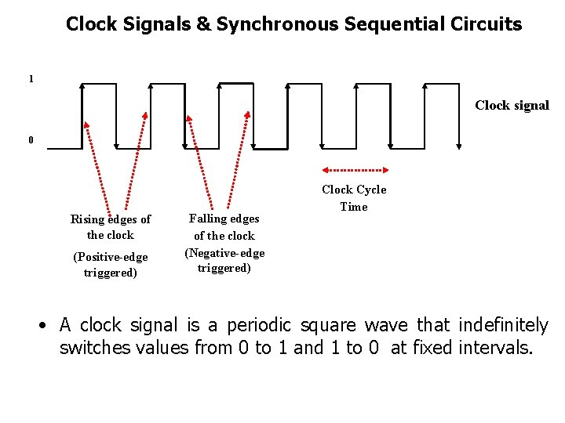

# UIUCTF Gatekeeping Writeup
## By CSN3RD

This is my writeup for Gatekeeping, one of my favorite challenges from UIUCTF. It was also one of the tougher challenges in the competition, worth 417 out of 500 possible points by the end of the event with dynamic scoring.

This challenge was worth so much that I went up 10+ places on the leaderboard after solving it. In the end, I placed 30th out of 650+ teams as a solo player. I also placed 18th on the per-user leaderboard out of 1800+ competitors!

## Problem Statement


## Analysis
Let's take a look through the Verilog code in [synth.v](synth.v). (Verilog is a hardware design language which is used to define and model a circuit.) In this case, the inputs to our circuit are

```
1. CLK (clock)
2. RESET_N
3. BYTE which contains 8 bits
```

At the bottom of the file, we see that the registers in each state are updated on the positive/rising edges of the clock. As a reference, this diagram explains how clocks work in logic design.



For many circuits, reset signals are used to force everything to a particular state. In this circuit, the reset signals contribute to the value of the wires.

Within the module, we have a 26 bit register called state and 206 wires that form a majority of the circuit. The bits in BYTE seem to be the main factors to determine the value of each state and wire.

The output is just a bit called GOOD.

## Solution

From our analysis, the output of the circuit is a bit called GOOD. We will assume that the end goal is for GOOD to evaluate to True. After tracing the code by hand for a few steps, we figure out that most of the wires are connected using AND, OR, NAND, and NOR gates. Each state has a corresponding BYTE such that the state evaluates to True. Thus, we can write some python code to figure out the order of the states and their corresponding BYTEs to form the flag.

To implement this, we can first parse the file and build a tree based on the definitions/equations in synth.v. The values of each state, wire, and bit in BYTE can then be determined using algorithms such as DFS or BFS with the output as the root. In this case, the circuit is set up such that there is no ambiguity and only one set of bits can lead to a state being True. We can verify this manually by printing out every assignment and checking that no statements are ambiguous. Thus, we can use DFS to get the order of the states and the corresponding BYTE for the state to be True (If there is ambiguity, we could use BFS to get all possibile flags and manually figure out the right one). In the end, we convert each BYTE to a character to form the flag.

## Code
Link: [solve.py](solve.py)

Breakdown:

**Part 1 - Go through synth.v and store the important lines**

```python
f = open('synth.v','r')
h = open('log.txt','w')

# d - synth.v definitions, e - synth.v equations
d,e={},{} 

for l in f:
    if '=' not in l:
        continue
    line = l.split('=')
    if 'assign' in line[0]:
        line[0] = line[0].replace('assign','')
    line[0] = line[0].replace('<','')
    line[0] = line[0].replace(' ','')

    e[line[0]] = line[1]

    line[1] = line[1].replace('(','')
    line[1] = line[1].replace(')','')
    line[1] = line[1].replace('&','')
    line[1] = line[1].replace('|','')
    line[1] = line[1].replace('~','')
    line[1] = line[1].replace(';','')

    x = line[1].split()
    for rh in x:
        if line[0] in d:
            d[line[0]] += [rh]
        else:
            d[line[0]] = [rh]
```

**Part 2 - Figure out the values of each wire and register.**

```python
# DFS starting with GOOD = True, reverse until 6 states left (uiuctf)
# statecount keeps track of the number of states visited so far
# Assume every value is on the positive edge of the clock
# Reset signal will be T/F depending on what will make the statement evaluate truthfully

# b - solved boolean values, visited - visited nodes and their names
b={}
visited = []
def dfs(currnodename, currnode, statecount):
    global visited
    if currnode in d:
        x = d[currnode]
        bo = 'F'
        if b[(currnodename,currnode)] == 'T':
            if '&' in e[currnode]:
                bo = 'T'
            elif '~' in e[currnode] and '|' in e[currnode]:
                bo = 'F'
            elif '~' in e[currnode]:
                bo = 'F'
            else:
                bo = 'T'
        else:
            if '~' in e[currnode] and '&' in e[currnode]:
                bo = 'T'
            elif '|' in e[currnode]:
                bo = 'F'
            elif '~' in e[currnode]:
                bo = 'T'
            else:
                bo = 'F'

        h.write("{}:{}".format(b[(currnodename,currnode)],e[currnode]))
        h.write(bo+"\n")

        ind = 0
        for rh in x:
            ind += 1
            if 'RESET_N' in rh:
                continue
            if 'state' in rh:
                statecount += 1
                if statecount > 20:
                    continue
                visited += [(rh,rh)]
                b[(rh,rh)] = bo
                dfs(rh,rh,statecount)
            else:
                c = 0
                s = rh+str(statecount)
                visited += [(s,rh)]
                b[(s,rh)] = bo
                dfs(s,rh,statecount)

visited += [("GOOD", "GOOD")]
b[("GOOD", "GOOD")] = 'T'
dfs("GOOD", "GOOD",0)
```

**PART 3 - Getting the flag**

```python
# go through each set of bytes and get the character formed
# since we started from the end, we must go from the bytes
# with largest statecount to the bytes with the smallest

flag = ""
for i in range(1,21):
    currbyte = ""
    for j in range(8):
        if b[("BYTE["+str(j)+"]"+str(i),"BYTE["+str(j)+"]")] == 'T':
            currbyte = "1"+currbyte
        else:
            currbyte = "0"+currbyte
    flag = chr(int(currbyte,2))+flag

print("Flag: uiuctf{}".format(flag))
f.close()
h.close()
```

## Output/Flag
Flag: `uiuctf{1ts_pUr3ly_l0gIcal}`

In this case, there were no statements that were ambiguous. We can verify this by checking [log.txt](log.txt). If there were any ambiguous statements, we could use BFS to get all possible flags and then filter through them by hand.

## Visualization
We can take our solve.py code and print to a GraphViz (.gv) file which allows us to view and visualize the values of each state, wire, and BYTE.

The code to generate the .gv file can be found in [graph.py](graph.py). Most of the code is related to formatting and styling the graph.

To get the pdf and png images from [graph.gv](graph.gv), we can run
```
dot -Tpdf graph.gv -o graph.pdf
dot -Tpng graph.gv -o graph.png
```

The default dpi is 96 but the png becomes too large for Github so I have used `-Gdpi=40`.


Note: Green means True / 1 and blue means False / 0. Flag is displayed in purple.

For better quality, take a look at [graph.pdf](graph.pdf) or generate the png with a higher dpi on your local machine (this make take a while).
